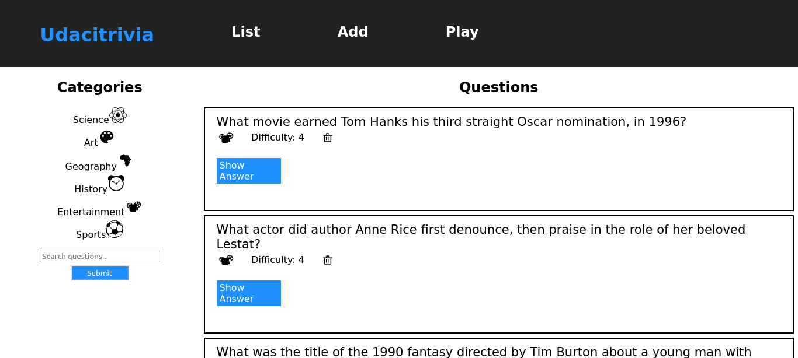
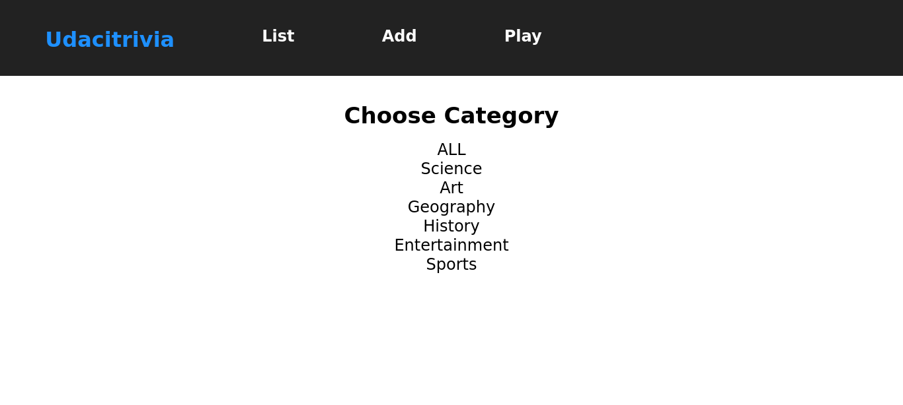

# API Development and Documentation Final Project

## Trivia App

Udacity is invested in creating bonding experiences for its employees and students. A bunch of team members got the idea to hold trivia on a regular basis and created a webpage to manage the trivia app and play the game, but their API experience is limited and still needs to be built out.

With this app, users can : 

1. Display questions - both all questions and by category. Questions should show the question, category and difficulty rating by default and can show/hide the answer.
2. Delete questions.
3. Add questions and require that they include question and answer text.
4. Search for questions based on a text query string.
5. Play the quiz game, randomizing either all questions or within a specific category.

There are some screenshots : 





## Starting and Submitting the Project

[Fork](https://help.github.com/en/articles/fork-a-repo) the project repository and [clone](https://help.github.com/en/articles/cloning-a-repository) your forked repository to your machine. Work on the project locally and make sure to push all your changes to the remote repository before submitting the link to your repository in the Classroom.

## About the Stack

### Backend

The [backend](./backend/README.md) directory contains a partially completed Flask and SQLAlchemy server. You will work primarily in `__init__.py` to define your endpoints and can reference models.py for DB and SQLAlchemy setup. These are the files you'd want to edit in the backend:

1. `backend/flaskr/__init__.py`
2. `backend/test_flaskr.py`

> View the [Backend README](./backend/README.md) for more details.

### Frontend

The [frontend](./frontend/README.md) directory contains a complete React frontend to consume the data from the Flask server. If you have prior experience building a frontend application, you should feel free to edit the endpoints as you see fit for the backend you design. If you do not have prior experience building a frontend application, you should read through the frontend code before starting and make notes regarding:

1. What are the end points and HTTP methods the frontend is expecting to consume?
2. How are the requests from the frontend formatted? Are they expecting certain parameters or payloads?

Pay special attention to what data the frontend is expecting from each API response to help guide how you format your API. The places where you may change the frontend behavior, and where you should be looking for the above information, are marked with `TODO`. These are the files you'd want to edit in the frontend:

1. `frontend/src/components/QuestionView.js`
2. `frontend/src/components/FormView.js`
3. `frontend/src/components/QuizView.js`

> View the [Frontend README](./frontend/README.md) for more details.

## API Reference

### Getting Started
- Base URL : As the app is not actually hosted and depending on the argument passed when running the backend server, the default base url is [http://127.0.0.1:5000/](http://127.0.0.1:5000/)
- Authentication : There is currently no authentication required for this app

### Error Handling
Errors are returned as JSON objects in the following format:
```
{
    "error": 400,
    "message": "bad request"
}
```
The API will return three error types when requests fail:
- 400: Bad Request
- 404: Resource Not Found
- 405: Method Not Allowed
- 422: Not Processable
- 500: Internal Server Error

### Endpoints

#### GET /categories
- General : 
    - Get all categories in the database with their respective `id` and `type`
- `curl http://127.0.0.1:5000/categories`

```json
{
    "categories": {
        "1": "Science",
        "2": "Art",
        "3": "Geography",
        "4": "History",
        "5": "Entertainment",
        "6": "Sports"
    },
    "success": true
}
```

#### GET /questions
- General :
    - 
- `curl http://127.0.0.1:5000/questions?page=2`
```json
{
    "categories": {
        "1": "Science",
        "2": "Art",
        "3": "Geography",
        "4": "History",
        "5": "Entertainment",
        "6": "Sports"
    },
    "questions": [
        {
            "answer": "Mona Lisa",
            "category": 2,
            "difficulty": 3,
            "id": 17,
            "question": "La Giaconda is better known as what?"
        },
        {
            "answer": "One",
            "category": 2,
            "difficulty": 4,
            "id": 18,
            "question": "How many paintings did Van Gogh sell in his lifetime?"
        },
        {
            "answer": "Jackson Pollock",
            "category": 2,
            "difficulty": 2,
            "id": 19,
            "question": "Which American artist was a pioneer of Abstract Expressionism, and a leading exponent of action painting?"
        },
        {
            "answer": "The Liver",
            "category": 1,
            "difficulty": 4,
            "id": 20,
            "question": "What is the heaviest organ in the human body?"
        },
        {
            "answer": "Alexander Fleming",
            "category": 1,
            "difficulty": 3,
            "id": 21,
            "question": "Who discovered penicillin?"
        },
        {
            "answer": "Blood",
            "category": 1,
            "difficulty": 4,
            "id": 22,
            "question": "Hematology is a branch of medicine involving the study of what?"
        },
        {
            "answer": "Scarab",
            "category": 4,
            "difficulty": 4,
            "id": 23,
            "question": "Which dung beetle was worshipped by the ancient Egyptians?"
        },
        {
            "answer": "Because",
            "category": 1,
            "difficulty": 1,
            "id": 24,
            "question": "Why so serious?"
        }
    ],
    "success": true,
    "total_questions": 18
}
```

#### DELETE /questions/{question_id}
- General : 
    - Delete a question based on `question_id` and return the id of the deleted question
- `curl --location --request DELETE 'http://127.0.0.1:5000/questions/6'`
```json
{
    "deleted_question": 6,
    "success": true
}
```

#### POST /questions
- General :
    - Add a new question by providing the following fields as a JSON object :
    
|name|type|description|
|---|---|---|
|question|string|The question to ask|
|answer|string|The answer to the above question|
|category|int|The id of the category of the question|
|difficulty|int|The difficulty of the question|
```sh
curl --location --request POST 'http://127.0.0.1:5000/questions' \
--header 'Content-Type: application/json' \
--data-raw '{
    "question": "",
    "answer": "",
    "category": 1,
    "difficulty": 5
}'
```
```json
{
    "success": true
}
```

#### POST /search
- General : 
    - Get paginated questions based on `searchTerm`
```sh
curl --location --request POST 'http://127.0.0.1:5000/search' \
--header 'Content-Type: application/json' \
--data-raw '{
    "searchTerm": "What"
}'
```
```json
{
    "questions": [
        {
            "answer": "Apollo 13",
            "category": 5,
            "difficulty": 4,
            "id": 2,
            "question": "What movie earned Tom Hanks his third straight Oscar nomination, in 1996?"
        },
        {
            "answer": "Tom Cruise",
            "category": 5,
            "difficulty": 4,
            "id": 4,
            "question": "What actor did author Anne Rice first denounce, then praise in the role of her beloved Lestat?"
        },
        {
            "answer": "Lake Victoria",
            "category": 3,
            "difficulty": 2,
            "id": 13,
            "question": "What is the largest lake in Africa?"
        },
        {
            "answer": "Mona Lisa",
            "category": 2,
            "difficulty": 3,
            "id": 17,
            "question": "La Giaconda is better known as what?"
        },
        {
            "answer": "The Liver",
            "category": 1,
            "difficulty": 4,
            "id": 20,
            "question": "What is the heaviest organ in the human body?"
        },
        {
            "answer": "Blood",
            "category": 1,
            "difficulty": 4,
            "id": 22,
            "question": "Hematology is a branch of medicine involving the study of what?"
        }
    ],
    "success": true,
    "total_questions": 6
}
```

#### GET /categories/{category_id}/questions
- General : 
    - Get paginated questions based on the id of a category
    - `curl --location --request GET 'http://127.0.0.1:5000/categories/2/questions'`
```json
{
    "currentCategory": "Art",
    "questions": [
        {
            "answer": "Escher",
            "category": 2,
            "difficulty": 1,
            "id": 16,
            "question": "Which Dutch graphic artist–initials M C was a creator of optical illusions?"
        },
        {
            "answer": "Mona Lisa",
            "category": 2,
            "difficulty": 3,
            "id": 17,
            "question": "La Giaconda is better known as what?"
        },
        {
            "answer": "One",
            "category": 2,
            "difficulty": 4,
            "id": 18,
            "question": "How many paintings did Van Gogh sell in his lifetime?"
        },
        {
            "answer": "Jackson Pollock",
            "category": 2,
            "difficulty": 2,
            "id": 19,
            "question": "Which American artist was a pioneer of Abstract Expressionism, and a leading exponent of action painting?"
        }
    ],
    "totalQuestions": 4
}
```

#### POST /quizzes
- General :
    - This is the endpoint used to play the trivia game.
    - It return questions sequentially without returning a previously returned question
```sh
curl --location --request POST 'http://127.0.0.1:5000/quizzes' \
--header 'Content-Type: application/json' \
--data-raw '{
    "previous_questions": [],
    "quiz_category": {
        "id": 1,
        "type": "Science"
    }
}'
```
```json
{
    "question": {
        "answer": "Blood",
        "category": 1,
        "difficulty": 4,
        "id": 22,
        "question": "Hematology is a branch of medicine involving the study of what?"
    }
}
```

## Acknowledgements

The Udacity team